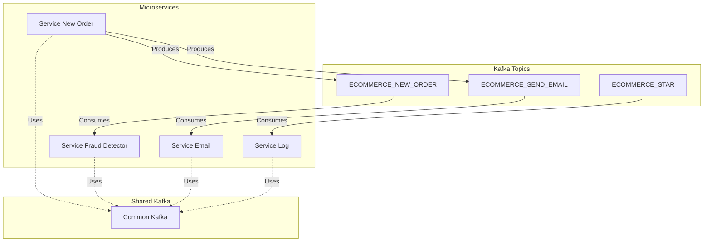

# E-commerce Services with Kafka Integration

## Services Overview

This project consists of a set of microservices designed to handle various aspects of an e-commerce platform, with a focus on event-driven architecture using Apache Kafka. Each service is responsible for a specific domain within the e-commerce ecosystem, such as logging, fraud detection, and email notifications.

## Services Overview

- **Log Service**: Captures and logs all messages from Kafka topics that match the pattern `ECOMMERCE.*`. This service is essential for monitoring and debugging activities across the e-commerce platform.

This project consists of a set of microservices designed to handle various aspects of an e-commerce platform, with a focus on event-driven architecture using Apache Kafka. Each service is responsible for a specific domain within the e-commerce ecosystem, such as logging, fraud detection, and email notifications.

## Services Overview

- **Fraud Detector Service**: Analyzes orders from the `ECOMMERCE_NEW_ORDER` Kafka topic to detect potential fraud. This service is crucial for maintaining the integrity of transactions within the platform.

- **Log Service**: Consumes messages from all `ECOMMERCE.*` topics to log activities across the platform.
- **Fraud Detector Service**: Consumes messages from the `ECOMMERCE_NEW_ORDER` topic to analyze orders for potential fraud.
- **Log Service**: Consumes messages from all `ECOMMERCE.*` topics to log activities across the platform.
- **Email Service**: Sends email notifications to customers. It listens to the `ECOMMERCE_SEND_EMAIL` Kafka topic for email events, processing and sending emails accordingly.

## Technologies Used

- **Email Service**: Consumes messages from the `ECOMMERCE_SEND_EMAIL` topic to send email notifications to customers.
- **Java**: The primary programming language used to implement the services.
- **Maven**: Dependency management and build tool.
- **Apache Kafka**: The messaging system that facilitates the asynchronous communication between services.

- **Fraud Detector Service**: Consumes messages from the `ECOMMERCE_NEW_ORDER` topic to analyze orders for potential fraud.
## Getting Started

To get a local copy up and running follow these simple steps.

### Prerequisites

- Java JDK 11 or later
- **Order Service**: Produces messages to `ECOMMERCE_NEW_ORDER` and `ECOMMERCE_SEND_EMAIL` topics to handle new orders and trigger email notifications.

- Apache Kafka and Zookeeper
- Maven

### Diagram of project 

### Installation Terminal Ubuntu - kafka-clients 2.3.1 

1. Clone the repo
   git clone git@github.com:LeonardoJaques/ecommerce-kafka-microservice-java.git

   cd ecommerce-kafka-microservice-java

   Navigate to your Kafka installation directory and run:

2. Init Zookeeper
   bin/zookeeper-server-start.sh config/zookeeper.properties

3. Init Kafka 
   bin/kafka-server-start.sh config/server.properties

## Kafka Topics

- `ECOMMERCE.*`: Wildcard topic for logging various activities.
   git clone https://github.com/leonardojaques/ecommerce-kafka-microservice-java.git
